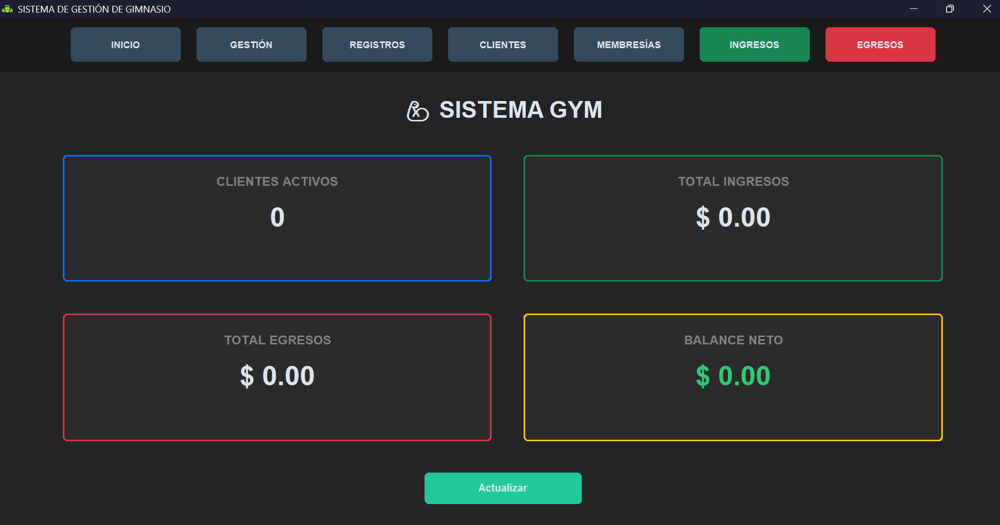

# 🏋️‍♂️ Sistema de Gestión de Gimnasio (App_Gym)

Una aplicación de escritorio robusta y moderna desarrollada en **Python** para la administración integral de gimnasios. Este sistema permite gestionar clientes, planes de entrenamiento, membresías, ingresos y egresos, todo bajo una interfaz oscura elegante impulsada por **CustomTkinter**.

---

## 🚀 Características Principales

* **📊 Dashboard Centralizado:** Visualización rápida de métricas clave como total de clientes, ingresos, egresos y balance neto de ganancias.
* **👥 Gestión de Clientes:** Registro detallado de socios incluyendo datos personales, historial médico (patologías, lesiones), y asignación de planes.
* **💳 Control de Membresías:** Monitoreo de estados de pago y fechas de vencimiento con filtros inteligentes (Al día, Por vencer, Vencido).
* **💰 Administración Financiera:**
    * **Módulo de Ingresos:** Seguimiento de pagos por planes con generación de gráficas estadísticas mediante Matplotlib.
    * **Módulo de Egresos:** Registro y control de gastos operativos con visualización gráfica.
* **📝 Planes y Rutinas:** Configuración personalizada de planes de entrenamiento (precio, días) y asignación de rutinas específicas por cliente.
* **🗄️ Persistencia de Datos:** Integración con **SQLite3** para un almacenamiento local seguro y eficiente de la información.

---

## 🛠️ Tecnologías Utilizadas

* **Lenguaje:** Python 3.x
* **Interfaz Gráfica:** [CustomTkinter](https://github.com/TomSchimansky/CustomTkinter) (UI Moderna)
* **Base de Datos:** SQLite3
* **Visualización de Datos:** Matplotlib (Gráficas de ingresos y egresos)
* **Manejo de Fechas:** Datetime

---

## 📦 Instalación y Configuración

### 1. Clonar el repositorio
```bash
git clone [https://github.com/Maicol843/App_Gym.git](https://github.com/Maicol843/App_Gym.git)
cd App_Gym
```
### 2. Instalar dependencias
Asegúrate de tener Python instalado y luego ejecuta:
```bash
pip install customtkinter matplotlib
```
### 3. Ejecutar la aplicación
El punto de entrada principal es el archivo dashboard.py:
```bash
python dashboard.py
```

---
## 🖥️ Estructura del Proyecto

* dashboard.py: Ventana principal y navegación del sistema.
* database.py: Lógica de creación y estructura de la base de datos gimnasio.db.
* clientes.py & registro_clientes.py: Listado, búsqueda y alta de nuevos socios.
* control_ingresos.py & control_gastos.py: Módulos de gestión financiera con gráficas.
* gestion_membresia.py: Seguimiento de estados de pago y vigencia.
* gestion_gimnasio.py: Configuración de los planes ofrecidos por el gimnasio.

---
<p align="center">
  
</p>
